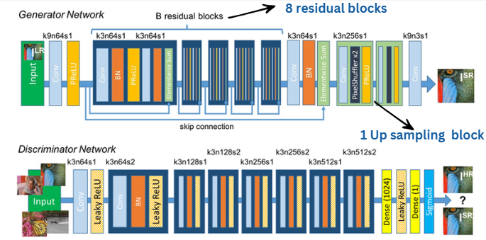
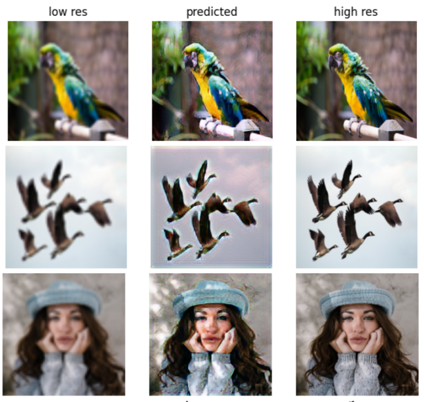
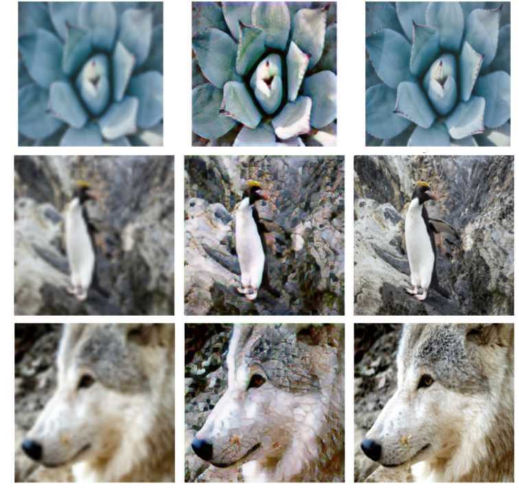

## Super Resolution Examples

- Implementation of ["Photo-Realistic Single Image Super-Resolution Using a Generative Adversarial Network"](https://arxiv.org/abs/1609.04802)

### SRGAN Architecture

<a href="/">
<div align="center">
	
</div>
</a>

### Prepare Data and Pre-trained VGG

- 1. You need to download the DIV2k dataset and create a dataset folder with train and test folder with low_resolution and high_resolution folders respectively.
- 2. You need to have the high resolution images for training.
  -  In this experiment, I used images from [DIV2K - bicubic downscaling x4 competition](http://www.vision.ee.ethz.ch/ntire17/), so the hyper-paremeters in `config.py` (like number of epochs) are seleted basic on that dataset, if you change a larger dataset you can reduce the number of epochs. 
  -  If you dont want to use DIV2K dataset, you can also use other datasets.

### Run

🔥🔥🔥🔥🔥🔥 You can run this google colab T4 GPU
🔥🔥🔥🔥🔥🔥 You can run on other external GPU's but you need create bash files


#### Train
- Set your image folder in `config.py`, if you download [DIV2K - bicubic downscaling x4 competition](http://www.vision.ee.ethz.ch/ntire17/) dataset. 
- Other links for DIV2K, in case you can't find it : [test\_LR\_bicubic_X4](https://data.vision.ee.ethz.ch/cvl/DIV2K/validation_release/DIV2K_test_LR_bicubic_X4.zip), [train_HR](https://data.vision.ee.ethz.ch/cvl/DIV2K/DIV2K_train_HR.zip), [train\_LR\_bicubic_X4](https://data.vision.ee.ethz.ch/cvl/DIV2K/DIV2K_train_LR_bicubic_X4.zip), [valid_HR](https://data.vision.ee.ethz.ch/cvl/DIV2K/validation_release/DIV2K_valid_HR.zip), [valid\_LR\_bicubic_X4](https://data.vision.ee.ethz.ch/cvl/DIV2K/DIV2K_valid_LR_bicubic_X4.zip).

Your directory structure should look like this:

```
srgan/
    └── config.py
    └── srgan.ipynb
    └── dataset
          └── Train
            ├── low_resolution
            └── high_resolution
          └── Test
            ├── low_resolution
            └── high_resolution

```

- Start training
- You can perform in 2 different ways.
  1. Training adverserially without any pretraining of generator
  2. Pretraining generator followed by Training adverserially
     

### Results

<div align="center">
	
</div>
<div align="center">
	
</div>


### Reference
* [1] [Photo-Realistic Single Image Super-Resolution Using a Generative Adversarial Network](https://arxiv.org/abs/1609.04802)
